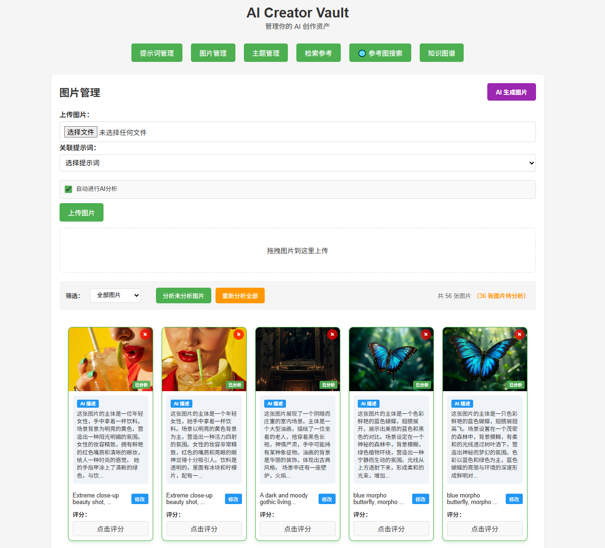

# AI Creator Vault

English | [中文版](docs/zh/README.md)

An asset management platform for AI creators, helping you securely store, organize, and retrieve AI-generated images, prompts, and other creative assets. Through knowledge graph technology, visually explore relationships between assets and trace creative evolution paths.

<p align="center">
  
</p>

## Features

### Core Features
- **Multi-user Authentication**: Complete user registration, login, and logout system with JWT + Refresh Token dual-token mechanism
- **Prompt Management**: Store and manage AI creative prompts with scoring and image association
- **Image Management**: Upload and manage AI-generated images with scoring and prompt association
- **AI Image Generation**: Generate images directly using the MiniMax API, supporting multi-image generation and various aspect ratios
- **Theme Management**: Organize reference images around themes with drag-and-drop upload and flexible categorization
- **Reference Image Search**: Search web reference images and download them to your local library with one click
- **User Isolation**: Files and data are isolated by user, ensuring privacy and security

### Intelligent Search
- **AI Image Analysis**: Automatically analyze image content and generate descriptions and embedding vectors
- **Vector Search**: High-performance semantic search powered by Qdrant
- **Hybrid Retrieval**: Combines keyword and semantic search with RRF algorithm for intelligent ranking
- **Image-to-Image Search**: Upload an image to search for visually similar content

### Knowledge Graph
- **Visual Graph**: Interactive graphical interface displaying assets and their relationships
- **Relationship Tracking**: Track chains of relationships between prompts, images, and derived versions
- **Path Discovery**: Find the shortest association path between assets
- **Derivative Management**: Support for various derivative types including edit, variant, upscale, and crop
- **Graph Traversal**: Breadth-first search for neighbor nodes to discover creative networks

## Tech Stack

- **Backend**: Node.js + Express.js + Sequelize
- **Database**: PostgreSQL + pgvector (production) / SQLite (development)
- **Cache**: Redis
- **Vector Database**: Qdrant
- **Frontend**: React + Vite + Nginx
- **AI Service**: Python + FastAPI + OpenAI API
- **Containerization**: Docker + Docker Compose

## Quick Start

### Docker Deployment (Recommended)

#### 1. Clone the Project

```bash
git clone https://github.com/legendPerceptor/aicreatorvault.git
cd aicreatorvault
```

#### 2. Configure Environment Variables

```bash
cp .env.example .env
```

Edit the `.env` file:

```env
# Database configuration
DB_NAME=aicreatorvault
DB_USER=aicreator
DB_PASSWORD=your_secure_password

# Upload file storage path (host directory)
# For NAS deployment, use absolute paths, e.g.:
# Synology: /volume1/docker/aicreatorvault/uploads
# Local development: ./uploads
UPLOADS_PATH=./uploads

# JWT authentication configuration
JWT_SECRET=your-super-secret-jwt-key-change-in-production
JWT_EXPIRES_IN=15m
REFRESH_TOKEN_EXPIRES_IN=7d
AUTH_COOKIE_SECURE=false  # Set to true in production (HTTPS)

# OpenAI API
OPENAI_API_KEY=sk-your-api-key
OPENAI_VISION_MODEL=gpt-4o-mini
OPENAI_EMBEDDING_MODEL=text-embedding-3-small

# Xray proxy configuration (required for accessing OpenAI API)
XRAY_CONFIG_PATH=./xray/config.json

# Brave Search API (optional, for reference image search)
BRAVE_API_KEY=your_brave_api_key

# MiniMax API (for AI image generation)
IMAGE_GEN_API_URL=https://api.minimaxi.com/v1/image_generation
IMAGE_GEN_API_KEY=your_minimax_api_key
```

#### 3. Configure Proxy

Edit `xray/config.json` to configure the proxy (for accessing OpenAI API):

```json
{
  "outbounds": [
    {
      "protocol": "vmess",
      "settings": {
        "vnext": [{
          "address": "your-server",
          "port": 443,
          "users": [{ "id": "your-uuid", "security": "auto" }]
        }]
      },
      "tag": "proxy"
    }
  ]
}
```

#### 4. Create Upload Directory

```bash
# Create the directory based on your UPLOADS_PATH
mkdir -p ./uploads
```

#### 5. Start Services

```bash
docker compose up -d
```

#### 6. Access the Application

- **Frontend**: http://localhost:5173
- **Backend API**: http://localhost:3001/api
- **AI Service**: http://localhost:8001
- **Qdrant Console**: http://localhost:6333/dashboard

### Docker Service Overview

| Service | Port | Description |
|---------|------|-------------|
| frontend | 5173 | React frontend (Nginx) |
| backend | 3001 | Node.js backend API |
| image-service | 8001 | Python AI image analysis service |
| postgres | 5432 | PostgreSQL + pgvector |
| redis | 6379 | Redis cache |
| qdrant | 6333/6334 | Qdrant vector database |
| aigc-xray | 8107 | Xray proxy service |

### Common Commands

```bash
# View service status
docker compose ps

# View logs
docker compose logs -f backend
docker compose logs -f image-service

# Stop services
docker compose down

# Rebuild
docker compose up -d --build

# Enter container
docker compose exec backend sh
docker compose exec image-service bash
```

---

## Local Development (Non-Docker)

If not using Docker, you can manually install each service:

### 1. Install Dependencies

```bash
npm install
cd frontend && npm install && cd ..
cd image-service && pip install -r requirements.txt && cd ..
```

### 2. Configure Environment Variables

```bash
cp .env.example .env
cp image-service/.env.example image-service/.env
```

### 3. Start Dependency Services

You need to manually start PostgreSQL, Redis, and Qdrant:

```bash
# PostgreSQL (requires pgvector extension)
# Redis
# Qdrant: docker run -p 6333:6333 qdrant/qdrant
```

### 4. Start Services

```bash
npm run start:backend       # Backend (3001)
npm run start:frontend      # Frontend (5173)
cd image-service && python main.py  # AI service (8001)
```

---

## Database Support

The project supports two databases:

| Database | Use Case | Vector Support |
|----------|----------|----------------|
| SQLite | Development, testing, small deployments | JSON storage |
| PostgreSQL | Production, large datasets | pgvector native vector type |

Docker deployment uses PostgreSQL + pgvector by default.

### Configuration

Set in the `.env` file:

```env
# Database type: sqlite or postgres
DB_TYPE=postgres

# PostgreSQL configuration
DB_HOST=localhost
DB_PORT=5432
DB_NAME=aicreatorvault
DB_USER=aicreator
DB_PASSWORD=your_password
```

---

## Project Structure

```
aicreatorvault/
├── backend/
│   ├── config/
│   │   └── database.js          # Database config factory
│   ├── models/
│   │   ├── index.js             # Database connection and model exports
│   │   ├── Prompt.js            # Prompt model
│   │   ├── Image.js             # Image model (with vector fields)
│   │   ├── Theme.js             # Theme model
│   │   ├── ThemeImage.js        # Theme-image association model
│   │   ├── Asset.js             # Unified asset model (knowledge graph)
│   │   ├── AssetRelationship.js # Asset relationship model (knowledge graph)
│   │   └── User.js             # User model
│   ├── routes/
│   │   ├── prompts.js           # Prompt API
│   │   ├── images.js            # Image API
│   │   ├── themes.js            # Theme API
│   │   ├── assets.js            # Asset management API (with derivative versions)
│   │   ├── graph.js             # Knowledge graph API
│   │   ├── auth.js              # Authentication API
│   │   ├── files.js             # Protected file service
│   │   └── referenceSearch.js   # Reference image search API
│   ├── middleware/
│   │   └── auth.js              # Authentication middleware
│   ├── utils/
│   │   ├── vectorSearch.js      # Vector search utilities
│   │   └── auth.js              # JWT authentication utilities
│   ├── services/
│   │   ├── imageServiceClient.js      # AI service client (image analysis)
│   │   ├── imageGenerationClient.js    # MiniMax image generation client
│   │   ├── graphService.js            # Graph traversal service
│   │   └── retrievalService.js        # Retrieval service (hybrid retrieval)
│   ├── migrations/              # Database migration scripts
│   │   ├── migrateToAssets.js   # Migrate to knowledge graph
│   │   └── addUsers.js         # Multi-user migration
│   ├── uploads/                 # Uploaded images
│   ├── temp/                    # Generated temporary images
│   ├── server.js                # Backend server
│   └── Dockerfile               # Backend container configuration
├── frontend/
│   ├── src/
│   │   ├── components/
│   │   │   ├── StarRating.jsx   # Rating component
│   │   │   ├── ImageCard.jsx    # Image card
│   │   │   ├── ImagePreviewModal.jsx  # Image preview
│   │   │   └── graph/           # Knowledge graph components
│   │   │       ├── GraphCanvas.jsx    # Graph canvas
│   │   │       ├── GraphControls.jsx  # Graph control panel
│   │   │       └── GraphNodeDetails.jsx # Node details
│   │   ├── pages/
│   │   │   ├── PromptsPage.jsx       # Prompt management
│   │   │   ├── ImagesPage.jsx        # Image management
│   │   │   ├── SearchPage.jsx        # Search page
│   │   │   ├── ThemesPage.jsx        # Theme management
│   │   │   ├── ReferenceSearchPage.jsx # Reference image search
│   │   │   └── KnowledgeGraphPage.jsx # Knowledge graph
│   │   ├── hooks/
│   │   │   ├── usePrompts.js         # Prompt data hook
│   │   │   ├── useImages.js          # Image data hook
│   │   │   ├── useThemes.js          # Theme data hook
│   │   │   ├── useAssets.js          # Asset data hook
│   │   │   ├── useGraph.js           # Graph data hook
│   │   │   └── useAuth.js           # Auth state hook
│   │   ├── pages/
│   │   │   ├── PromptsPage.jsx       # Prompt management
│   │   │   ├── ImagesPage.jsx        # Image management
│   │   │   ├── SearchPage.jsx        # Search page
│   │   │   ├── ThemesPage.jsx        # Theme management
│   │   │   ├── ReferenceSearchPage.jsx # Reference image search
│   │   │   ├── KnowledgeGraphPage.jsx # Knowledge graph
│   │   │   └── AuthPage.jsx         # Authentication page (login/register)
│   │   ├── App.jsx              # Main application component
│   │   ├── main.jsx             # Entry file
│   │   └── index.css            # Stylesheet
│   ├── public/                  # Frontend static files
│   ├── Dockerfile               # Frontend container configuration
│   └── docker/
│       └── nginx.conf           # Nginx configuration
├── image-service/
│   ├── main.py                  # AI service entry point
│   ├── image_processor.py       # Image processing and embedding generation
│   ├── requirements.txt         # Python dependencies
│   ├── pyproject.toml           # Project configuration
│   ├── .env                     # AI service environment variables
│   ├── .env.example             # Environment variable template
│   └── Dockerfile               # AI service container configuration
├── docker/
│   ├── README.md                # Docker deployment detailed documentation
│   └── init-pgvector.sql        # PostgreSQL pgvector initialization
├── xray/
│   ├── config.json              # Xray proxy configuration (gitignored)
│   └── config-example.json      # Proxy configuration example
├── docker-compose.yml           # Docker Compose orchestration
├── .dockerignore                # Docker ignore file
├── .env.example                 # Environment variable template
├── stop.sh                      # Stop services script
├── start.sh                     # Start services script
├── package.json                 # Project configuration
├── CLAUDE.md                    # Claude Code project guide
├── KNOWLEDGE_GRAPH.md           # Knowledge graph detailed documentation
├── RETRIEVAL_GUIDE.md           # Retrieval system design documentation
├── REFERENCE_SEARCH_DESIGN.md   # Reference image search design document
├── QDRANT_INTEGRATION.md        # Qdrant integration documentation
├── developers.md                # Developer guide
└── README.md                    # Project README
```

## API Endpoints

> **Note**: Most API endpoints require authentication (except auth APIs). Include the Access Token in the request header:
> ```bash
> -H "Authorization: Bearer <access_token>"
> ```

### Authentication API (No Auth Required)

- `POST /api/auth/register` - Register a new user
- `POST /api/auth/login` - User login
- `POST /api/auth/logout` - User logout
- `POST /api/auth/refresh` - Refresh Access Token
- `GET /api/auth/me` - Get current user info

#### Get Access Token Example

```bash
# 1. Login to get token
curl -X POST -H "Content-Type: application/json" \
  -d '{"email":"your@email.com","password":"yourpassword"}' \
  -c cookies.txt \
  http://localhost:3001/api/auth/login

# 2. Use Access Token to access protected APIs
curl -H "Authorization: Bearer <access_token>" \
  http://localhost:3001/api/prompts
```

### Prompt API (Authentication Required)

- `GET /api/prompts` - Get all prompts
- `GET /api/prompts/unused` - Get unused prompts
- `POST /api/prompts` - Create a new prompt
- `PUT /api/prompts/:id/score` - Update prompt score
- `DELETE /api/prompts/:id` - Delete a prompt

### Image API

- `GET /api/images` - Get all images
- `POST /api/images` - Upload an image (auto-analyze)
- `POST /api/images/generate` - AI generate image (MiniMax)
- `POST /api/images/:id/analyze` - Analyze an image
- `POST /api/images/batch-analyze` - Batch analyze images
- `PUT /api/images/:id/score` - Update image score
- `PUT /api/images/:id/prompt` - Update associated prompt
- `DELETE /api/images/:id` - Delete an image
- `POST /api/images/search` - Text-to-image search
- `POST /api/images/search-by-image` - Image-to-image search
- `POST /api/images/search/hybrid` - Hybrid retrieval (keyword + semantic)

### Theme API

- `GET /api/themes` - Get all themes
- `POST /api/themes` - Create a new theme
- `POST /api/themes/:id/images` - Add image to theme
- `DELETE /api/themes/:id/images/:imageId` - Remove image from theme

### Reference Image Search API

- `POST /api/reference-search/search` - Search web reference images
- `POST /api/reference-search/download` - Download and add a reference image
- `POST /api/reference-search/batch-download` - Batch download reference images

### Asset Management API (Knowledge Graph)

- `GET /api/assets` - Get all assets
- `GET /api/assets/:id` - Get single asset details
- `POST /api/assets` - Create a new asset
- `POST /api/assets/:id/derived` - Create a derived version (edit/variant/upscale/crop)
- `PUT /api/assets/:id` - Update asset info
- `DELETE /api/assets/:id` - Delete an asset
- `GET /api/assets/:id/versions` - Get all derived versions of an asset

### Knowledge Graph API

- `GET /api/graph/nodes` - Get all graph nodes
- `GET /api/graph/edges` - Get all graph edges
- `GET /api/graph/neighbors/:id` - Get neighbors of a node
- `GET /api/graph/path/:fromId/:toId` - Find shortest path between two nodes
- `GET /api/graph/traverse/:id` - Breadth-first graph traversal
- `GET /api/graph/components` - Get connected components
- `POST /api/graph/relationship` - Create an asset relationship
- `DELETE /api/graph/relationship/:id` - Delete an asset relationship

## Development Guide

### Code Standards

The project uses Prettier for code formatting and pre-commit to automatically format code before commits.

```bash
# Manually format code
npx prettier --write "**/*.js"
```

### Architecture Overview

- **Component-based Design**: Split UI into reusable components (StarRating, ImageCard, GraphCanvas)
- **Page Separation**: Each functional module is an independent page component
- **State Management**: Use custom Hooks to encapsulate data fetching and state logic
- **Single Responsibility**: Each file is responsible for one function, making it easy to maintain and test
- **Database Abstraction**: Support multiple databases through Sequelize ORM
- **Vector Search**: Dual support with Qdrant vector database + pgvector
- **Hybrid Retrieval**: RRF algorithm fuses keyword and semantic search results
- **Unified Asset Model**: Prompts, images, and derived images are unified as Assets for easy relationship management
- **Graph Service**: Independent graph traversal service supporting BFS, shortest path, and other algorithms
- **Relationship Tracking**: Records generation, derivation, versioning, and inspiration relationship types between assets

## Knowledge Graph

AI Creator Vault introduces a knowledge graph feature that unifies all creative assets (prompts, images, derived versions) and tracks their relationships.

### Core Concepts

- **Asset Types**:
  - `prompt` - AI creative prompt
  - `image` - AI-generated original image
  - `derived_image` - Derived image (edit, variant, upscale, crop)

- **Relationship Types**:
  - `generated` - Prompt generates image
  - `derived_from` - Derived from original asset
  - `version_of` - Version relationship
  - `inspired_by` - Inspiration source

- **Derivative Types**:
  - `edit` - Edit modification
  - `variant` - Style variant
  - `upscale` - Upscale enhancement
  - `crop` - Crop

### Data Migration

If you are already using the legacy prompt and image management, you can run a migration script to import data into the knowledge graph:

```bash
node backend/migrations/migrateToAssets.js
```

## Multi-User Data Migration

After upgrading to the multi-user version, you need to run a user migration script to migrate existing data to the multi-user system:

```bash
# Local environment
node backend/migrations/addUsers.js

# Docker environment
docker exec -it <container_name> node backend/migrations/addUsers.js

# Preview mode (no actual changes)
node backend/migrations/addUsers.js --dry-run
```

Migration script features:
- Creates a default user `legacy@local` (ID=1)
- Adds `user_id=1` to all existing data
- Migrates uploaded files from `uploads/` to `uploads/users/1/images/`
- Supports multiple runs (idempotent operations)

**Note**: Please backup your database and uploaded files before migration.

## More Documentation

All documentation is available in both [English](docs/en/) and [中文](docs/zh/).

- [Docker Deployment Guide](docs/en/docker-deployment.md) - Detailed Docker deployment instructions
- [Knowledge Graph Documentation](docs/en/KNOWLEDGE_GRAPH.md) - Detailed usage and API examples for the knowledge graph
- [Retrieval System Design](docs/en/RETRIEVAL_GUIDE.md) - Hybrid retrieval and RRF algorithm documentation
- [Reference Image Search Design](docs/en/REFERENCE_SEARCH_DESIGN.md) - Reference image search feature design document
- [Qdrant Integration Documentation](docs/en/QDRANT_INTEGRATION.md) - Qdrant vector database integration guide
- [Qdrant Quick Start](docs/en/QDRANT_QUICKSTART.md) - Quick start guide for Qdrant integration
- [AI Search Improvement Plan](docs/en/AI_SEARCH_IMPROVEMENT.md) - AI intelligent retrieval module improvement plan
- [Qdrant Integration Report](docs/en/QDRANT_DELIVERY.md) - Qdrant integration completion report
- [Developer Guide](docs/en/developers.md) - Testing methods and database query commands
- [API Test Commands](docs/en/API_TEST_COMMANDS.md) - API testing curl commands
- [PostgreSQL Support](docs/en/postgres-support.md) - PostgreSQL installation and configuration
- [Pre-commit Configuration](docs/en/PRE-COMMIT-README.md) - Pre-commit code quality setup
- [Migration Guide](docs/en/migrations-guide.md) - Database migration for reference image fields
- [Naming Convention](docs/en/naming-convention.md) - Database naming convention migration guide
- [Image Service](docs/en/image-service.md) - Python AI image analysis service
- [Multi-User Authentication](docs/en/MULTI_USER_AUTHENTICATION.md) - Authentication system documentation
